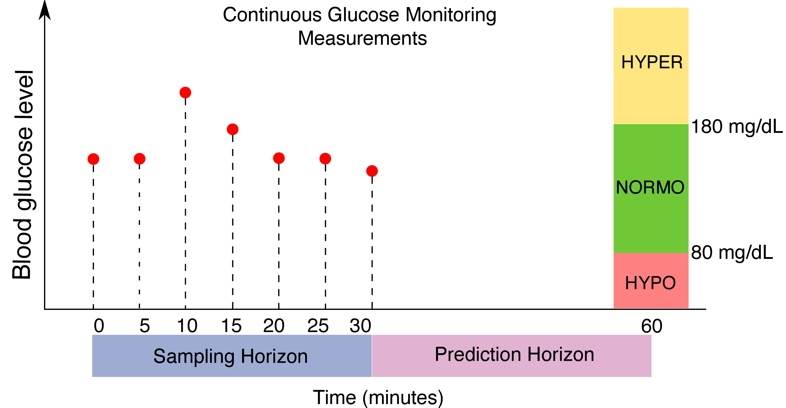

# Replicate the Model Proposed by Deng et al., 2021

The replication work relies on the code from the original study repository: https://github.com/yixiangD/AccurateBG. Not all of the files or functions from the original study are used in this study.

## Structure

```
AccurateBG/
├── accurate_bg/
│   ├── notebook/ # Reference notebook code. Deprecated
│   ├── cgms_data_seg_diatrend.py  # Data and model construction for the DiaTrend dataset.
│   ├── cgms_data_seg_t1dexi.py  # Data and model construction for the T1DEXI dataset.
│   ├── cgms_data_seg.py  # Data and model construction for the OhioT1DM dataset.
│   ├── CGMSData.py  # OhioT1DM Data loading, splitting, and preprocessing.
│   ├── CGMSDataDiaTrend.py  # OhioT1DM Data loading, splitting, and preprocessing.
│   ├── CGMSDataT1DEXI.py  # OhioT1DM Data loading, splitting, and preprocessing.
│   ├── cnn_ohio.py  # BG prediction CNN regressor for training, testing and transfer-learning.
│   ├── cnn.py  # Similar as cnn_ohio, but not used in this study.
│   ├── data_reader_DiaTrend.py  # Data reader. Only the function for Diatrend datset were used.
│   ├── data_reader_T1DEXI.py  # Data reader. Only the function for T1DEXI datset were used.
│   ├── data_reader.py  # Data reader. Only the function for OhioT1DM datset were used.
│   ├── diatrend_main.py  # Main function for training and evaluation on DiaTrend
│   ├── helper.py  # Helper functions, not used in this study.
│   ├── load_diatrend.py  # Helper functions, not used in this study.
│   ├── new_ohio_main.py # Main function for training and evaluation on OhioT1DM in this study.
│   ├── ohio_main.py # Previous main function for training and evaluation, not used in this study.
│   ├── t1dexi_main.py # Main function for training and evaluation on T1DEXI in this study. 
│   ├── The rest files were not used in this study.
├── diatrend_results/ # Prediction result on DiaTrend dataset
├── ohio_results/ # Prediction result on OhioT1DM dataset
├── t1dexi_results/ # Prediction result on OhioT1DM dataset
├── time-gan/ # Not used in this study
├── generate_result_from_txt.ipynb # Used to extract result from txt files to excels.
├── The rest files were not used in this study.
```


# Original README
## Accurate BG
Repository for paper [Deep transfer learning and data augmentation improve glucose levels prediction in type 2 diabetes patients](https://www.nature.com/articles/s41746-021-00480-x).


## Installation
We recommend you create a virtual environment via `Anaconda` or `Pyenv`, then
activate the virtual environment and run
```
>> make dev
```
We used tensorflow 1.15.0.
## Train and test for the *OhioT1DM* dataset
To test for the OhioT1DM dataset, create a folder named `data` at the root directory
```
>> mkdir data/
```
Then, download the public dataset *OhioT1DM* [here](http://smarthealth.cs.ohio.edu/OhioT1DM-dataset.html), and move the unzipped folder `OhioT1DM` into `data`. (Note that to use the dataset, you need to apply for it with the link provided and we are unfortunately not able to provide the dataset for you.)

To train and test for the *OhioT1DM* dataset, with our optimal configuration, run
```
>> cd accurate_bg
>> python3 ohio_main.py --epoch 150
```
the default prediction horizon is 6, equivalently 30 min. To adjust prediction horizon to 1hr, modify
the last line of command in the code block above with
```
>> python3 ohio_main.py --epoch 150 --prediction_horizon 12
```
## Reference
If you find this repo or our work helpful, we encourage you to cite the paper below.
```
@article{deng2021deep,
  title={Deep transfer learning and data augmentation improve glucose levels prediction in type 2 diabetes patients},
  author={Deng, Yixiang and Lu, Lu and Aponte, Laura and Angelidi, Angeliki M and Novak, Vera and Karniadakis, George Em and Mantzoros, Christos S},
  journal={NPJ Digital Medicine},
  volume={4},
  number={1},
  pages={1--13},
  year={2021},
  publisher={Nature Publishing Group}
}
```
